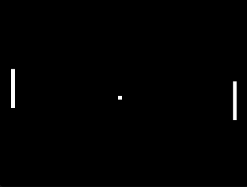
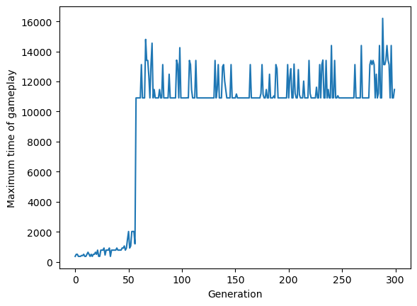

# Artificial Neural Networks trained by a Genetic Algorithm to play... Pong?!
Created by Teo Bergkvist as a final project in the course EXTG15 at Lund University.

I made this project to demonstrate a cool use case of ANNs (Artificial Neural Networks) and Genetic Algorithms. 

Result of 300 generations is shown below:

## Setup
- Clone this repository or download the files manually.
- Make sure to have python installed.
- Run `pip install -r requirements.txt` inside the repository directory.
- If everything goes well, the program should now be set-up.

## Usage
- Open the ipython notebook `main.ipynb` with vs-code, jupyter notebook or wherever you usually code.
- The notebook is well commented and needs no more explanation.

## Training
- Use the script `speed_training.py` to speed up training.

With the parameters: 2 layers, 6 neurons each, 300 generations, 30 players in each generation and 0.1 mutation rate, the time of game play was as following:

## Note
Feel free to use the code in this project. If you use it as it is, or use large parts of it, please give credit to [Teo Bergkvist](https://github.com/tbergkvist).
